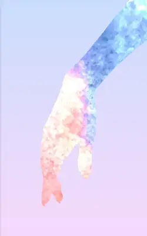
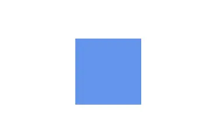
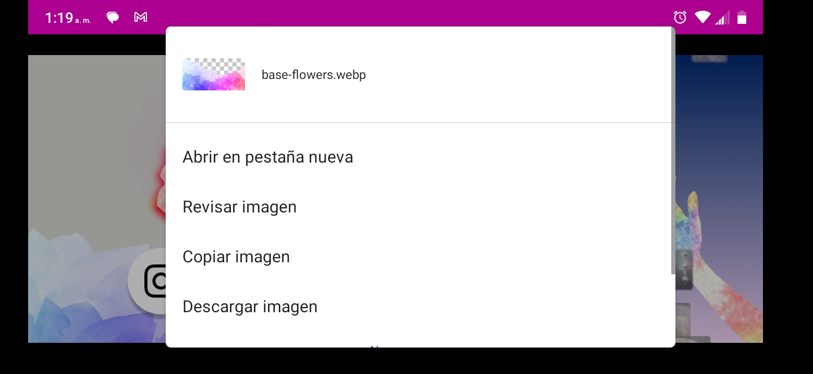

# jewelry-landing-page

[🚀 Probar la aplicación en línea](https://aldolunabueno.github.io/jewelry-landing-page/){:target="_blank"}

## Creation Process

Comencé por el diseño que en mi cabeza tenía el mayor impacto: la animación ascendente de fotos.

```css
aside .animated {
  /* many tricks for constant velocity*/
  --t: 4s;
  --h: 50;
  --top: 90;
  --t0: calc(var(--t) * (var(--h) + var(--top)) / 100.0);
  position: absolute;
  height: calc(var(--h) * 1vh);
  top: calc(var(--top) * 1vh);
  left: 30vw;
  animation: 
    elevate var(--t0) linear,
    elevate-loop var(--t) linear var(--t0) infinite;
}

@keyframes elevate {
  to {
    transform: translateY(calc(-1 * (var(--top) + var(--h)) * 1vh));
  }
}

@keyframes elevate-loop {
  from {
    transform: translateY(calc(100vh - var(--top) * 1vh));
  }
  to {
    transform: translateY(calc(-1 * (var(--top) + var(--h)) * 1vh))
  }
}
```

Demasiado complicado. La clave para simplificarlo fue descubrir que el delay puede ser negativo.

```js
document.querySelectorAll('aside .animated img').forEach(img => {
  const delay = Math.random() * -30; // delay negativo
  img.style.animationDelay = `${delay}s`;
  ...
});
```

```css
aside .animated {
  position: absolute;
  border-radius: 3px;
  box-shadow: 0 2px 2px;
  top: 100vh;
  animation: elevate 10s linear infinite;
}

@keyframes elevate {
  to {
    transform: translateY(-150vh);
  }
}
```

Continué agregando las fotos reales. Empecé cargando  la primera foto desde el script:

```js
const imgContainer = document.querySelector("aside .animated ")
const link = "images/jewels/image1.png"
const image = document.createElement("img")
image.src = link
imgContainer.append(image)
}
```

Solo repetí el patrón y definí una constante para la cantidad de imagenes en el directorio _images/jewels/_:

```js
const NUMBER_JEWELS = 14
const imgContainer = document.querySelector("aside .animated ")
for (let i = 1; i <= NUMBER_JEWELS; i++) {
  const link = "images/jewels/image" + i + ".png"
  const image = document.createElement("img")
  image.src = link
  imgContainer.append(image)
}
```

Un problema que noté fue que las imagenes demoraban cerca de medio segundo en cargar. Las fotos pesaban cerca de 1 MB, lo cual se explica porque estaban en formato PNG. El formato recomendado para la web es WEBP. Realicé la conversión de cada imagen usando este comando del programa de consola FFMPEG:

```bash
ffmpeg -i image.png -c:v libwebp -compression_level 6 -y image.webp
```

El resultado general fue una compresión 20:1 con una diferencia de calidad casi inapreciable.

Luego proseguí con el embellecimiento de los elementos estáticos. Usé Photoshop para recortar y así darle transparencia a las imagenes PNG del logo y los fondos. Por cierto, ahí me di cuenta de que el llogo pesa 4 MB, y hay que hacer algo al respecto, pero luego.

Para el logo quise darle un borde que sea tan colorido como su contenido, y por eso usé una copia del mismo logo escalado justo para que sobresalga desde detrás y con una saturación magnificada. Encima coloqué el nombre con un efecto de neón.

```css
main .logo img {
  position: absolute;
  display: block;
  width: auto;
  height: 55%;
  z-index: -1;
}

.scalated-border {
  transform: scale(1.05);
  filter: blur(3px) opacity(95%) saturate(1500%);
}
```


Lo siguiente que hice fue trabajar el brazo de fondo. Se me ocurió convertir el brazo en una máscara. Para mi sorpresa, esto se puede hacer con CSS.

```css
aside .background {
  position: absolute;
  width: auto;
  height: 110vh;
  transform: translate(-25%, -10%);
}

.masked-image {
  mask-image: url('images/female-hand.png');
  mask-position: 70% 20%;
  mask-size: 65%;
}
```



Satisfecho con estos resultados, volví a la animación de las fotos. Estas se ven muy bien elevandose, pero sería mucho mejor que se ampliaran cuando se pasa el cursor por encima. Este efecto se logra con una transición en el selector y una regla para la pseudoclase hover correspondiente a este selector que describa las propiedades que cambian.

El problema que encontré fue que la propiedad que quería cambiar es el ancho, y esta no está descrita en el CSS: establecemos su valor usando JavaScript.

El siguiente ejemplo reduce mi problema al mínimo para entenderlo mejor:

```html
<div class="rect"></div>
```

```css
.rect {
  background: cornflowerblue;
  height: 100px;
  transition: width 1s;
}

.rect:hover {
  width: 200px
}
```

```js
const rect = document.querySelector(".rect")
rect.style.width = "100px"
```



¿Por qué no se ensancha a 200px cuando hago hover con el cursor? La respuesta está en alguna parte de la extensa explicación sobre la especificidad en CSS. Los estilos en línea, aquellos que se agregan directamente en los elementos HTML (mala práctica) o programáticamente con JavaScript, tienen mayor especificidad que los selectores de CSS. Entonces, aquí gana el de mayor especificidad, el código: `rect.style.width =  100px`. No importa si defino un hover porque sigue siendo un selector, inferior en especificidad.

Es preciso entonces un mecanismo que le dé una mayor especificidad, y este es  `!important`. Solo basta agregarlo aquí para que la transición funcione:

```css
.rect:hover {
  width: 200px !important
}
```

Esto resuleve mi problema, aunque hay que hacer un par de cosas más para que las fotos queden centradas en su lugar al ser ampliadas.

Una vez terminado esto, reduje el tamaño de las demás imágenes con ffmpeg convirtiéndolas al formato WEBP, excepto la máscara, que tiene que estar en formato PNG. Esta solo la comprimí sin pérdidas.

Pero la máscara tiene un problema: no se muestra correctamente. Es incómodo posicionarla. Por eso decidí hacer el efecto en Photoshop.

El nuevo problema:

```html
<div class="square"></div>
```

```css
.square {
  position: absolute;
  width: 100px;
  height: 100px;
  background: cornflowerblue;
  right: 0;
}
```

La solución:

```css
@media (max-width: 750px) {
  .square {
    left: calc(750px - 100px); /* Set left position */
    right: auto; /* Disable the right property */
  }
}
```

¿Cómo hacer los botones? La clave para tener un código CSS limpio es almacenar los atributos distintivos de cada ícono en HTML para luego pasarlos a CSS.

Íconos

```bash
ffmpeg -i icon.png -vf scale=256:-1 icon.ico
ffmpeg -i icon.png -vf scale=16:-1 icon16.ico
ffmpeg -i icon.png -vf scale=32:-1 icon32.ico
```

Un fallo importante es que, cuando se navega a través del móvil, las imágenes se abren al ser tocadas y presionadas. Y en el navegodor las imágenes pueden ser arrastradas.



La solución:

```js
// for all images
  image.draggable = false // navegador
  image.addEventListener("contextmenu", (e) => e.preventDefault()); // móvil
```
